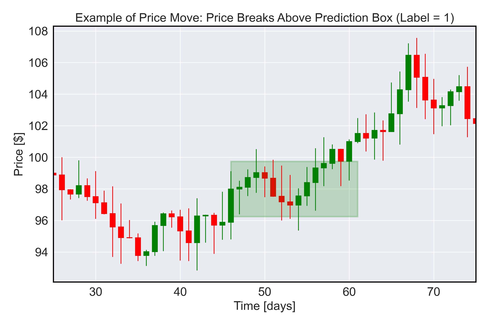
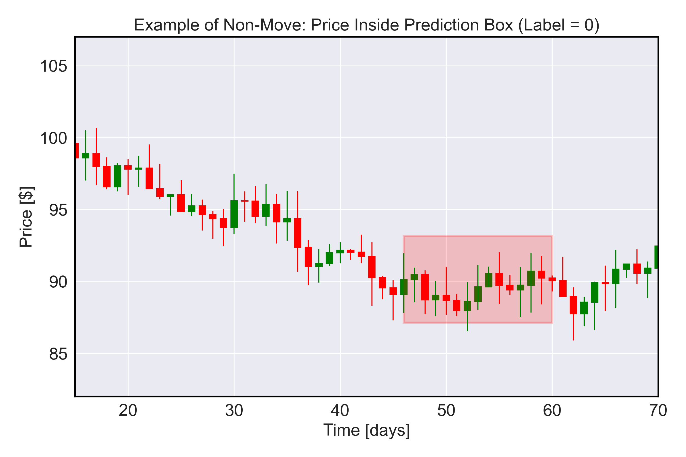
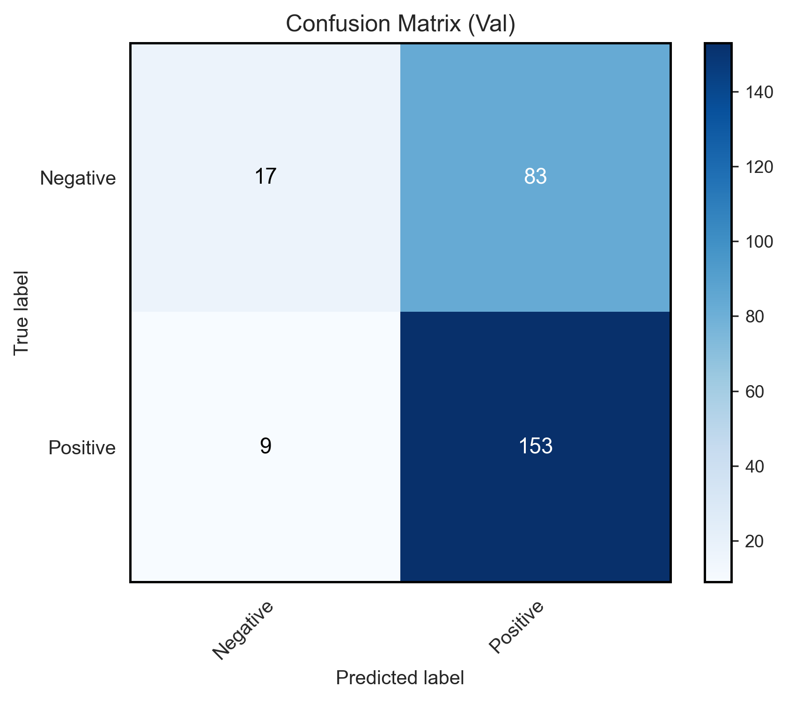
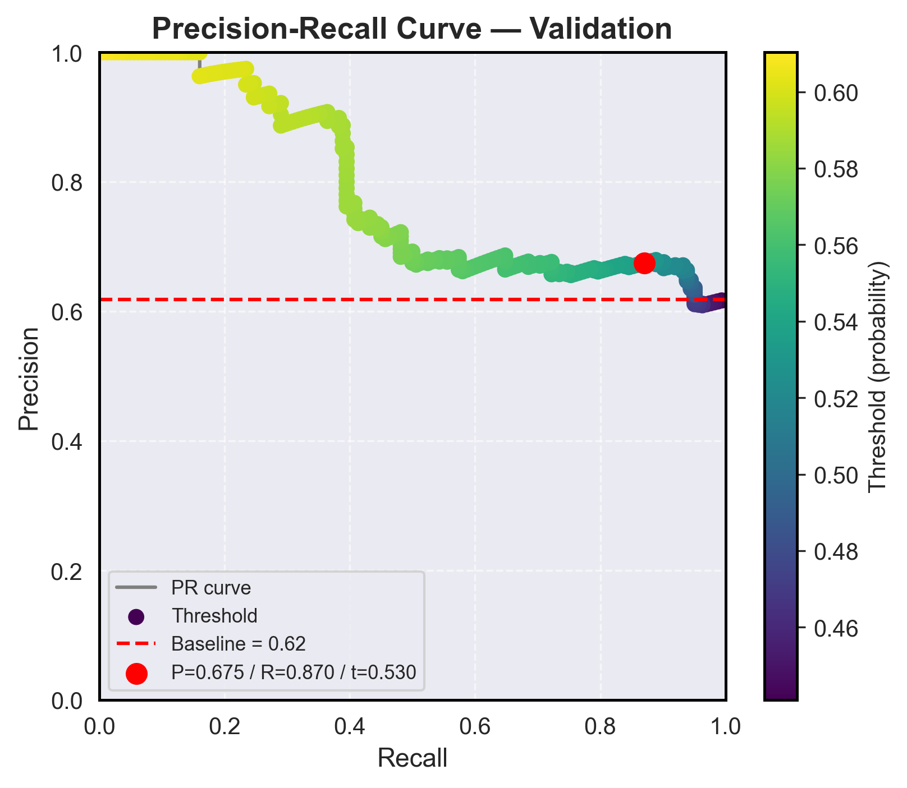
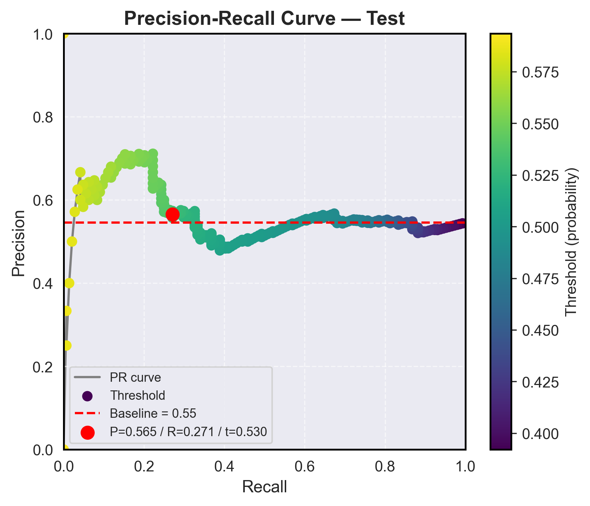
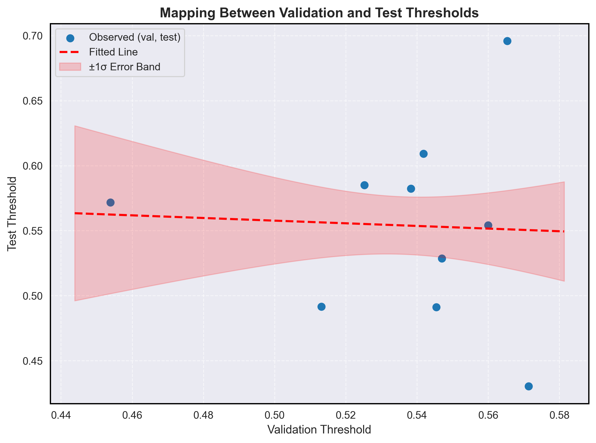
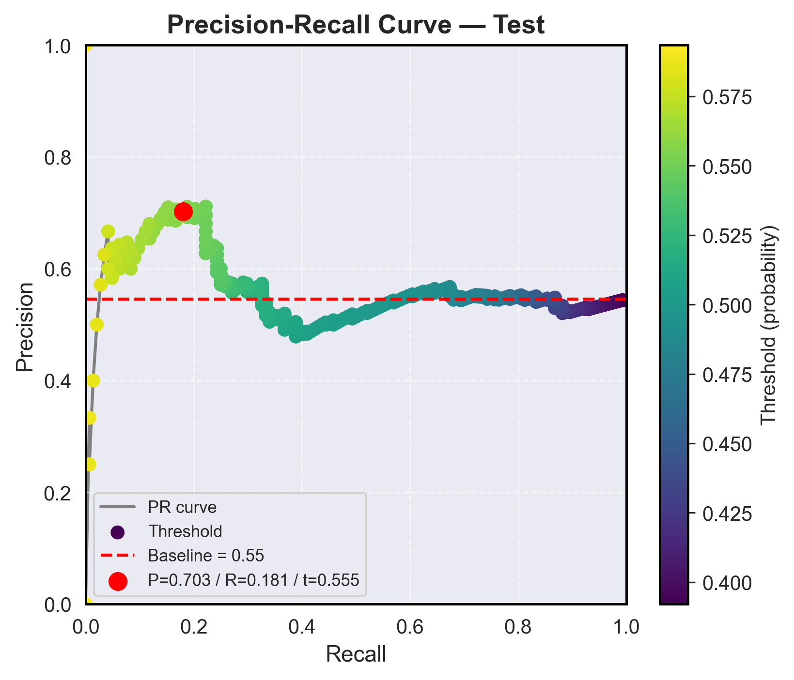

# A Categorical LSTM to Predict Stock Price Movements  

### Turning noisy market data into actionable signals with LSTM-based threshold classification.


Classical models such as **Black–Scholes** assume stock log-returns follow a Brownian motion. While this approximation holds in the long run, real markets exhibit **short-term autocorrelations and structural deviations** from pure randomness. These pockets of predictability are noisy but exploitable, creating opportunities for systematic strategies.  

Instead of forecasting exact return magnitudes (a regression task prone to error in noisy data), this project reframes the problem as a **categorical classification**:  
- **Up** if price increases beyond a positive threshold  
- **Down** if price decreases beyond a negative threshold  
- **Neutral** if price remains within the threshold band  

This shift focuses the model on directional movement rather than precise values, making predictions more robust and directly actionable.  

We apply **LSTM neural networks**, which are well suited to capture temporal dependencies in sequential financial data. Compared to rigid rules-based approaches, LSTMs offer **greater flexibility and adaptability across assets, horizons, and regimes**. Even modest accuracy above random chance (50%) can translate into **profitable trading signals** when paired with sound risk management.  

This repository demonstrates how **modern sequence models can extract signal from market noise** and provides a reproducible framework for threshold-based prediction, evaluation, and deployment.  

### Conceptual Illustration

|  |  |
|-------------------------------------------|--------------------------------------------|
| **Class label `1` example:** Dummy data illustrating when the stock’s closing price exits the box **above the defined threshold**. In this setup, class `1` can alternatively represent cases where the closing price exits **below the box**, depending on the labeling convention. | **Class label `0` example:** Dummy data illustrating when the stock’s closing price exits the box **without crossing above the threshold**. If the task is to predict upward movements, closing prices that exit **below the box** are also labeled as `0`. |


## 📋 Quick Navigation

| Section              | Link                                                         |
| -------------------- | ------------------------------------------------------------ |
| 🚀 Executive Summary | [Jump to Executive Summary](#executive-summary)              |
| 🎯 Motivation        | [Jump to Motivation](#motivation)                            |
| 🔬 Methodology       | [Jump to Methodology](#methodology)                          |
| 📊 Experiments       | [Jump to Experiments](#experiments)                          |
| 🖼️ Results          | [Jump to Results](#results)                                  |
| ⚙️ How to Reproduce  | [Jump to How-to-Reproduce](#how-to-reproduce)                |
| 📘 User Guide        | [Jump to User Guide](#user-guide)                            |
| 🚧 Limitations       | [Jump to Limitations & Next Steps](#limitations--next-steps) |
| 📂 Directory         | [Jump to Directory Structure](#directory-structure)          |
| 📚 Further Docs      | [Jump to Further Documentation](#further-documentation)      |

---

## Executive Summary

This project develops a **binary classifier that predicts stock price movements** using LSTM sequence models, delivering a practical tool for anticipating upward vs. non-upward trends.  
A key methodological contribution is a **k-fold cross-validation mapping** that links validation-optimal thresholds (τ_val) to expected test-optimal thresholds (τ_test), ensuring more reliable deployment.  
Together, these components provide:

- A reproducible training and evaluation pipeline.
- Transparent performance metrics and diagnostics.
- Deployment-ready threshold mapping that reflects real-world conditions.
- Demonstrated, substantial improvement over baseline performance.

---

## Motivation

Accurately predicting **stock price movements** is a core challenge in quantitative finance, where even small improvements in precision can drive meaningful returns.  
While powerful sequence models such as LSTMs can capture temporal patterns, **their raw outputs still depend on the choice of decision threshold**.  
A threshold tuned only on validation data often fails to generalize, leading to **over-optimistic backtests and degraded live performance**.

To address this, we introduce a **cross-validation–based mapping** from τ_val → τ_test:  
- Empirically corrects for the validation–test mismatch.  
- Can be applied in deployment without access to test labels.  

The result is a system that combines a **strong predictive model** with **robust threshold calibration**, producing more reliable and stable trading signals while reducing the risk of model decay in production.

---

## Methodology

📊 **Flow Diagram**  

```
Data → Feature Engineering → Normalization → Sequence Creation & Splitting
    → LSTM Training → Threshold Optimization → K-Fold CV
    → Linear Mapping (τ_val → τ_test) → Deployment
```

Our approach follows a structured, config-driven end-to-end pipeline designed for reproducible time-series classification and robust threshold selection. The methodology balances statistical rigor with practical deployment considerations:

1. **Data Preprocessing & Normalization**  
   Raw OHLC price data is augmented with technical indicators (`SMA`, `MACD`, `Bollinger Bands`, `Stochastic Oscillator`, `% Returns`), clipped for outliers, and normalized using leak-safe scaling strategies, with accompanying [diagnostic plots](results/APPL_daily_experiment/figures/APPL_daily_experiment_feature_norm_comparison_train.pdf) to verify normalization quality.

2. **Sequence Creation & Data Splitting**  
   Overlapping rolling windows are constructed to capture temporal dependencies. Splits are time-ordered to respect causality.  

3. **Model Training**  
   A **regularized LSTM classifier** is trained to capture non-linear temporal dependencies in multivariate price series.  
   - **Robustness:** Class weighting mitigates imbalance between directional regimes (up, down, flat).  
   - **Generalization:** Early stopping with validation monitoring guards against overfitting to market noise.  
   - **Optimization:** The Adam optimizer with carefully tuned learning rates ensures stable convergence in non-stationary settings.  
   - **Statistical rigor:** Performance is tracked using both aggregate accuracy and class-level diagnostics (precision, recall), enabling detection of asymmetric error profiles.  

   This setup emphasizes **signal extraction under heavy noise**, balancing flexibility with regularization — a practical approach for financial time series where sample sizes are limited and overfitting risk is high.

4. **Threshold Optimization**  
   Decision thresholds are tuned against precision, recall, and F1 to identify robust operating points.  

5. **K-Fold Cross-Validation**  
   Multiple folds are used to characterize the relationship between validation and test thresholds, reducing variance in model selection.  

6. **Threshold Mapping for Deployment**  
   A linear relation τ_test ≈ a·τ_val + b, derived from k-fold analysis, provides a principled way to estimate test-time thresholds from validation results, an essential step for real world deployment of models.


🔗 **Detailed Documentation**  
For full explanations of each stage, see:  
- [docs/methodology.md](docs/methodology.md) – complete methodology document  
- [docs/kfold_cv.md](docs/kfold_cv.md) – in-depth k-fold cross-validation analysis  

---

## Experiments

* Dataset: **AAPL 8-year daily data**  
* Model: LSTM binary classifier  
* Objective metric: **Precision** (default), with support for Recall, F1  
* Baselines:  
  - **Random guessing** — establishes whether the model captures meaningful signal.  
  - **Naïve τ_val threshold** — compared against the adjusted τ from the CV mapping procedure.
---

## Results

### Our model alone beats random (+1.98%), and our pipeline mapping elevates test precision to **+15.7% over baseline**.


### 1. **Performance Evidence**

- **Training & Model Selection**  
  - We generate a series of [diagnostic plots](results/APPL_daily_experiment/figures/APPL_daily_experiment_combined_diagnostics.pdf) to monitor **training dynamics** (loss evolution, validation accuracy, learning rate) and **decision behavior** (threshold probability distributions). These diagnostics confirm stability, convergence, and the interpretability of the model’s outputs.
  - The model reached its **best validation loss at epoch 14**, and this version was used for evaluation.  

- **Validation Performance**  
  - Default threshold τ = 0.5: **Precision = 64.8%**, above the random baseline of 61.8%.  
  - After optimization, the **chosen τ_val = 0.530** achieved **Precision = 67.5%** with **Recall = 87.0%**.
  - This equates to a perfomance on the test set of **+1.98% over baseline** (See Figure 3).


<!-- First row: Confusion matrix centered -->
<p align="center">
  
</p>
<p align="center"><sub><i>Figure 1. <b>Confusion Matrix</b> – Raw classification outcomes (TP, FP, TN, FN) for the validation set. The numbers are calculated from the default threshold τ_val = 0.5.</i></sub></p>

<!-- Second row: PR curves side by side -->
<p align="center">
  
  
</p>
<p align="center"><sub><i>Figure 2. <b>Validation Precision–Recall Curve (before mapping)</b> – The color of the curve encodes the classification threshold used at each point. The dashed red line indicates the random baseline (precision = 0.62). The red point represents the chosen optimal threshold.  
<br>Figure 3. <b>Test Precision–Recall Curve (before mapping)</b> – The color of the curve encodes the classification threshold used at each point. The dashed red line indicates the random baseline (precision = 0.55). The red point represents the same (naïve) threshold from the validation PR curve.</i></sub></p>


### 2. **K-Fold CV Threshold Mapping** 

- **Cross-Validation Diagnostics**  
  - [Plots](results/APPL_daily_experiment/figures/APPL_daily_experiment_k_fold_diagnostics.pdf) show the τ_val → τ_test linear fit and fold-by-fold performance stability.

- **Cross-Validation Threshold Mapping**  
  - Linear fit coefficients: **a = -0.1018, b = 0.6086** (See Figure 4).  
  - τ_val = 0.530 mapped to **τ_test = 0.555**.  

- **Test Performance (out-of-sample)**  
  - At τ_test = 0.555: **Precision = 70.3%**, **Recall = 18.1%**.  
  - This represents a **+15.7% improvement over the baseline (54.5%)**.  
  - High precision at lower recall highlights a conservative decision boundary—exactly the property desired for deployment scenarios.  

<!-- First row: Threshold mapping centered -->
<p align="center">
  
</p>
<p align="center"><sub><i>Figure 4. <b>Validation-to-Test Threshold Mapping</b> – Pairs of optimal thresholds from validation and test folds (blue points) with a fitted linear model (red dashed line) and ±1σ error band (shaded region).</i></sub></p>

<!-- Second row: PR curves side by side -->
<p align="center">
  
  
</p>
<p align="center"><sub><i>Figure 5. <b>Validation PR Curve with Optimal τ</b> – Validation set PR curve with the point chosen for k-fold derivation marked.  
<br>Figure 6. <b>Test PR Curve with Optimal τ</b> – Test set PR curve with the k-fold–derived optimal threshold marked.</i></sub></p>


### 3. Implications for a Trading Strategy

The model is learning meaningful structure in the data; the improvement in precision validates that the workflow can deliver **non-trivial predictive signals** for financial markets. Looking forward, precision is just one lens. In trading, **profitability depends not only on being right, but on how much you gain when right versus how much you lose when wrong**. For this reason, two more **directly actionable objectives** are natural extensions:  

- **Sharpe Ratio (SR):** Balances expected return against risk/volatility, reflecting the quality of a strategy’s risk-adjusted performance.  
- **Expected Value (EV) per trade:** Captures the net profitability by weighting win sizes and loss sizes against their probabilities.  

Optimizing over SR or EV moves the research closer to a deployable trading strategy, since these metrics directly incorporate **risk and payoff structure**, not just classification accuracy.

More concretely, the **expected value (EV) per trade** at threshold τ is defined as:

EV(τ) = p(τ) * μ_win(τ) + (1 – p(τ)) * μ_loss(τ) – C

where:  
- p(τ) = probability of a correct prediction at threshold τ (model precision for trades taken)  
- μ_win(τ) = average return per winning trade, conditional on being correct  
- μ_loss(τ) = average return per losing trade, conditional on being wrong (typically negative)  
- C = average round-trip transaction costs (commission, slippage, borrow fees)

In practice, our K-fold cross-validation mapping can be extended to run a full backtest that computes EV across different values of τ. This allows us to **select the threshold that maximizes expected profitability**, making the output directly actionable as a trading strategy.

---

## How to Reproduce

```bash
git clone https://github.com/jbhiggi/tauTrader
cd tauTrader 
pip install -e .

# Run all experiments
python run_all.py
```

---

## Limitations & Next Steps  

This project is a **proof of concept** rather than a production trading system. Results are constrained by the small dataset (~2,000 daily candles) and non-optimized hyperparameters. A dedicated **Hyperparameter Optimization Pipeline (HOP)** is in progress and expected to yield performance gains. Future improvements include training on larger and higher-frequency data, refining the labeling strategy, and integrating the model with a buy/sell signal generator. Evaluation should also shift from pure classification metrics toward finance-specific objectives such as Sharpe ratio or expected value.  

See [Limitations](docs/limitations.md) for full details.

---

## Directory Structure

```bash
.
├── README.md # Project overview
├── LICENSE # License information
├── pyproject.toml # Package configuration
├── run_all.py # Script to run the full pipeline
│
├── docs/ # Documentation and supporting figures
│  ├── kfold_cv.md
│  ├── model_training.md
│  ├── limitations.md
│  └── *.png
│
├── experiments/ # Notebooks & scripts for exploratory runs
│  ├── train_model.py
│  ├── train_kfold.py
│  └── map_tau.py
│
├── quant_lstm/ # Core package code
│  ├── __init__.py
│  ├── data_loader.py
│  ├── preprocessing.py
│  ├── feature_engineering.py
│  ├── model.py
│  ├── train.py
│  ├── evaluate.py
│  ├── cv_evaluate.py
│  ├── map_tau_utils.py
│  └── configs/
│     └── config.yaml # Central configuration file
│
├── raw_data/ # Example dataset(s)
│  └── apple_data.csv
│
├── results/ # Saved model outputs & reports
│  └── APPL_daily_experiment/
│     ├── figures/ # Diagnostic & PR curve plots
│     ├── modified_data/ # Normalized and clipped datasets
│     ├── *.json # Training reports, linear fits, metadata
│     └── *.keras # Saved model weights
│
└── master_figures/ # Publication-quality figures
└── *.png
```

---

## Further Documentation

| 📊 Topic                   | Link                                   |
|----------------------------|----------------------------------------|
| 🔁 K-Fold Cross-Validation | [K-fold CV](docs/kfold_cv.md)          |
| 📑 Methodology Doc         | [Full Methodology](docs/methodology.md)|
| ⚠️ Limitations             | [Limitations](docs/limitations.md)     |

---

## License  
MIT License. See [LICENSE](LICENSE) for details.